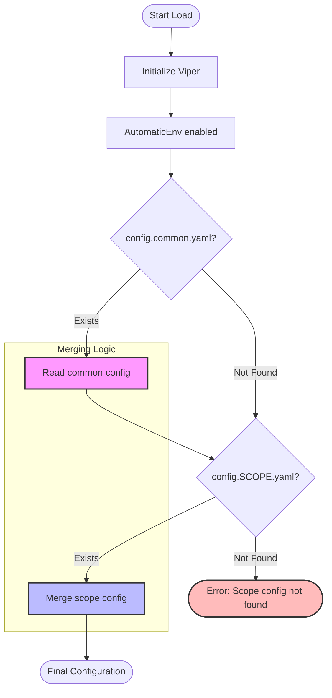

# go-scope-config

[](https://pkg.go.dev/github.com/arielsrv/go-scope-config)
[](https://goreportcard.com/report/github.com/arielsrv/go-scope-config)
[](https://arielsrv.github.io/go-scope-config/)

## Table of Contents

- [Installation](#installation)
- [Usage](#usage)
- [Configuration Merging (Inheritance)](#configuration-merging-inheritance)
- [Example File Structure](#example-file-structure)
- [Code](#code)
  - [Using LoadDefault (Autoloader)](#using-loaddefault-autoloader)
- [Automatic Autoloader (init function)](#automatic-autoloader-init-function)
  - [1. Using DefaultViper (named import)](#1-using-defaultviper-named-import)
  - [2. Using Blank Import (global Viper)](#2-using-blank-import-global-viper)
  - [Manual Initialization (With Options)](#manual-initialization-with-options)
- [Architecture](#architecture)
  - [Loader API](#loader-api)
- [Examples](#examples)
  - [Run examples](#run-examples)
- [Logger Support](#logger-support)
- [Commands](#commands)
- [Environment Variables](#environment-variables)

Go package for loading environment-based configurations (`SCOPE`) using [Viper](https://github.com/spf13/viper).

This package is particularly well-suited for **Kubernetes** environments, where
the `SCOPE` variable (e.g., `dev`, `staging`, `prod`) can be easily injected
into Pods as an environment variable, allowing the application to automatically
pick the correct configuration file based on the cluster environment.

The environment variable name (`SCOPE`) is configurable to support different
organizational standards.

## Installation

```bash
go get github.com/arielsrv/go-scope-config
```

## Usage

The package automatically looks for the `SCOPE` environment variable.
If it's not defined, it uses `dev` by default.

It searches for files with the pattern `config.[SCOPE].yaml` or
`config.[SCOPE].yml` in a folder (default is `config/`).

### Configuration Merging (Inheritance)

If a `config.common.yaml` (or `.yml`) exists in the configuration directory,
it will be loaded first as a base configuration. Then, the scope-specific file
(`config.[SCOPE].yaml`) will be merged into it, overriding any shared keys.



### Example File Structure

```text
.
├── config/
│   ├── config.common.yaml (base values)
│   ├── config.dev.yaml    (overrides for dev)
│   └── config.prod.yml    (overrides for prod)
└── main.go
```

### Code

#### Using LoadDefault (Autoloader)

The quickest way to start with default options:

```go
package main

import (
    "fmt"
    "log/slog"
    "os"
    goscopeconfig "github.com/arielsrv/go-scope-config"
)

func main() {
    // Local logger to avoid using the global slog
    logger := slog.Default()

    // Loads from "config/" folder using SCOPE env var (defaults to "dev")
    v, err := goscopeconfig.LoadDefault()
    if err != nil {
        logger.Error("Error loading default config", "error", err)
        os.Exit(1)
    }

    fmt.Printf("App Name: %s\n", v.GetString("app.name"))
}
```

### Automatic Autoloader (init function)

The package provides two ways to automatically load the configuration.

#### 1. Using DefaultViper (named import)

If you import the package with a name, you can access the pre-initialized
`DefaultViper` instance.

```go
package main

import (
    "fmt"
    "log/slog"
    "os"
    goscopeconfig "github.com/arielsrv/go-scope-config"
)

func main() {
    // Local logger to avoid using the global slog
    logger := slog.Default()

    // Check if there was an error during automatic loading
    if goscopeconfig.ErrLoad != nil {
        logger.Error("Error loading config", "error", goscopeconfig.ErrLoad)
        os.Exit(1)
    }

    // Use the pre-loaded instance
    v := goscopeconfig.DefaultViper
    fmt.Printf("App Name: %s\n", v.GetString("app.name"))
}
```

#### 2. Using Blank Import (global Viper)

If you want to use the standard `github.com/spf13/viper` package directly,
you can use the `autoload` sub-package with a blank import. This will load the
configuration into Viper's **global instance** (the singleton returned by
`viper.GetViper()`).

> [!IMPORTANT]
> This is distinct from the `DefaultViper` provided by the root package,
> which uses its own isolated Viper instance.

```go
package main

import (
    "fmt"
    _ "github.com/arielsrv/go-scope-config/autoload"
    "github.com/spf13/viper"
)

func main() {
    // Configuration is already loaded into global viper
    fmt.Printf("App Name: %s\n", viper.GetString("app.name"))
}
```

#### Manual Initialization (With Options)

```go
package main

import (
    "fmt"
    "log/slog"
    "os"
    goscopeconfig "github.com/arielsrv/go-scope-config"
)

func main() {
    // Local logger to avoid using the global slog
    logger := slog.Default()

    // Initializes the loader. 
    // By default, it looks in the "config/" folder and reads the
    // "SCOPE" environment variable.
    loader := goscopeconfig.New(
        goscopeconfig.WithConfigDir("custom_configs"),
        goscopeconfig.WithScopeEnv("APP_ENV"),
    )

    if err := loader.Load(); err != nil {
        logger.Error("Error loading config", "error", err)
        os.Exit(1)
    }

    // Access values via Viper
    v := loader.Viper()
    fmt.Printf("App Name: %s\n", v.GetString("app.name"))
    fmt.Printf("Current Scope: %s\n", loader.GetScope())
}
```

## Architecture

The `ConfigLoader` is the core component. It uses options for configuration:

- `New(...Option)`: Creates a loader.
- [NewWithViper(*viper.Viper, ...Option)](https://github.com/arielsrv/go-scope-config/blob/main/config_loader.go): Creates a loader
  using an existing Viper instance.
- [WithConfigDir(string)](https://github.com/arielsrv/go-scope-config/blob/main/config_loader.go): Custom configuration directory.
- [WithScope(string)](https://github.com/arielsrv/go-scope-config/blob/main/config_loader.go): Force a specific scope.
- [WithScopeEnv(string)](https://github.com/arielsrv/go-scope-config/blob/main/config_loader.go): Custom environment variable for scope.
- [WithLogger(Logger)](https://github.com/arielsrv/go-scope-config/blob/main/config_loader.go): Provide a logger for loading information.

### Loader API

- `loader.Load()`: Executes the loading and merging.
- `loader.Viper()`: Returns the internal `*viper.Viper` instance.
- `loader.GetScope()`: Returns the current detected scope.
- `loader.GetConfigPath()`: Returns the absolute path of the loaded
  configuration file.

## Examples

You can find complete examples in the `examples/` folder:

- [blank-import](https://github.com/arielsrv/go-scope-config/blob/main/examples/blank-import/main.go): Usage with blank import
  (global Viper).
- [autoloader](https://github.com/arielsrv/go-scope-config/blob/main/examples/autoloader/main.go): Quick start using `LoadDefault()`.
- [automatic](https://github.com/arielsrv/go-scope-config/blob/main/examples/automatic/main.go): Accessing the pre-initialized
  `DefaultViper`.
- [with-logger](https://github.com/arielsrv/go-scope-config/blob/main/examples/with-logger/main.go): Integrating with `slog`
  (JSON format).
- [custom-scope-env](https://github.com/arielsrv/go-scope-config/blob/main/examples/custom-scope-env/main.go): Using a custom
  environment variable for scope.
- [custom-dir](https://github.com/arielsrv/go-scope-config/blob/main/examples/custom-dir/main.go): Loading configurations from a
  non-standard directory.
- [merge-common](https://github.com/arielsrv/go-scope-config/blob/main/examples/merge-common/main.go): Demonstrating configuration
  inheritance and overrides.
- [uber-fx](https://github.com/arielsrv/go-scope-config/blob/main/examples/uber-fx/main.go): Integration with the Uber-FX
  dependency injection framework.
- [docker-compose](https://github.com/arielsrv/go-scope-config/blob/main/examples/docker-compose/main.go): Running inside a container
  with Docker Compose, demonstrating environment variable inheritance.

### Run examples

The examples are in a separate module. To run them, go to the `examples` directory:

```bash
cd examples
```

Then run the desired example:

```bash
go run simple/main.go
go run custom-dir/main.go
go run merge-common/main.go
go run autoloader/main.go
go run automatic/main.go
go run blank-import/main.go
go run with-logger/main.go
go run custom-scope-env/main.go
go run uber-fx/main.go
```

#### Docker Compose Example

To run the Docker Compose example:

```bash
cd examples/docker-compose
docker compose up
```

## Logger Support

You can provide a logger that satisfies the `Logger` interface (which has a
`Printf(format string, v ...any)` method). This allows easy integration with
both the standard `log` package and modern loggers like `slog`.

```go
// Example with slog (JSON format)
handler := slog.NewJSONHandler(os.Stdout, nil)
logger := slog.New(handler)

// Small wrapper to satisfy the Printf interface
type slogWrapper struct { logger *slog.Logger }
func (s *slogWrapper) Printf(f string, v ...any) {
    s.logger.Info(fmt.Sprintf(f, v...))
}

loader := goscopeconfig.New(
    goscopeconfig.WithLogger(&slogWrapper{logger: logger}),
)
loader.Load()
```

## Commands

The project uses [Taskfile](https://taskfile.dev/) to manage common tasks:

- `task test`: Run unit tests.
- `task lint`: Run linters (`golangci-lint`, `gofumpt`, `betteralign`).
- `task audit`: Verify modules, run `go vet` and `govulncheck`.
- `task markdown`: Lint markdown files.
- `task coverage`: Generate and show coverage report.
- `task clean`: Remove coverage and temporary files.
- `task build`: Build the project.

## Environment Variables

In addition to `SCOPE`, the package enables Viper's `AutomaticEnv()`, so you can
override any value from the YAML files using environment variables with the
corresponding prefix (by default no prefix, with the `.` separator replaced
by `_`).

Example: `APP_NAME=my-app` will override the value of `app.name` in the YAML.
